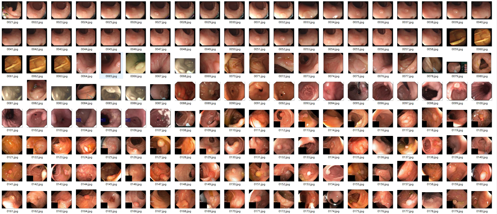
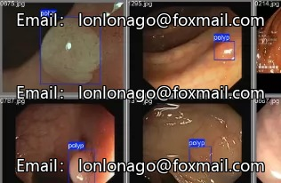
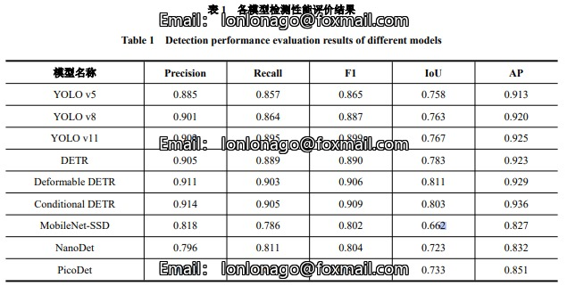
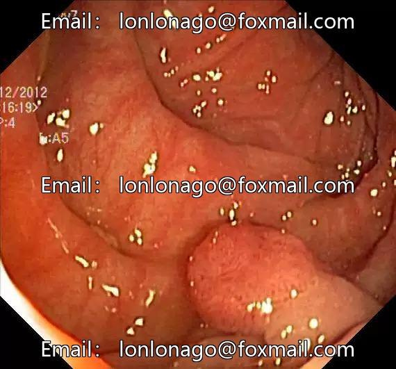
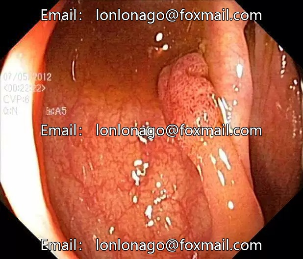
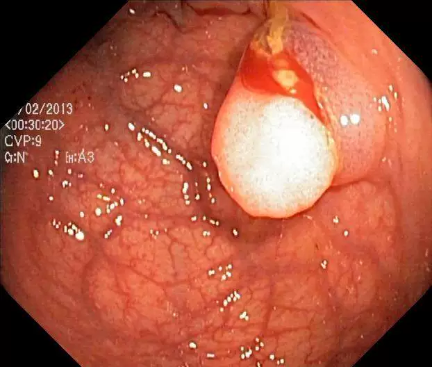

## Body

Gastrointestinal Endoscopy Polyp Target Detection Dataset - YOLO and XML Formats

The dataset consists of images from multiple public datasets and data images provided by a hospital, including various types and stages of polyps. It collects 5460 polyp images.

The dataset is divided into three subfolders, each containing the following content: (1) Polyp Images are stored in JPG format with raw image data ranging from 300×243 to 2559×1432. (2) XML format tags. (3) TXT format file tags.

The imaging conditions cover various cystic body shapes, such as malignant, benign, large pixels, and small pixels. The entire dataset is rich in samples and has strong generalization capabilities.

It is divided into 1 class, namely polyp (polyp).

Source of the dataset can be found in the article.

Electronic virtual products sold without return or exchange.

## Images

Here is a pay link on Stripe ( https://buy.stripe.com/3cs8yP7sY87d0vu9AB ). Please contact me lonlonago@foxmail.com after funding $89, and I will send you a complete data files , thank you!

